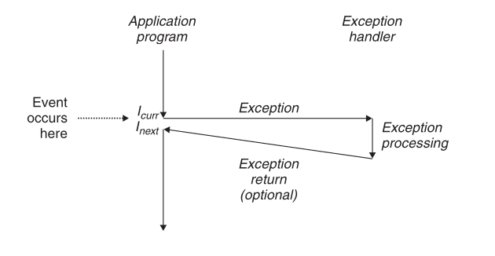
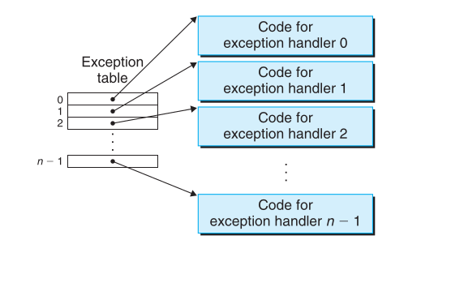
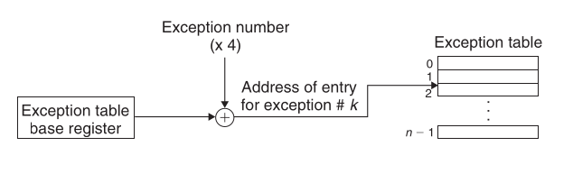
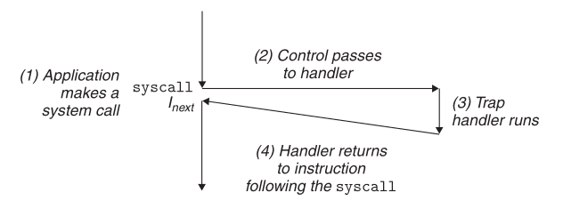
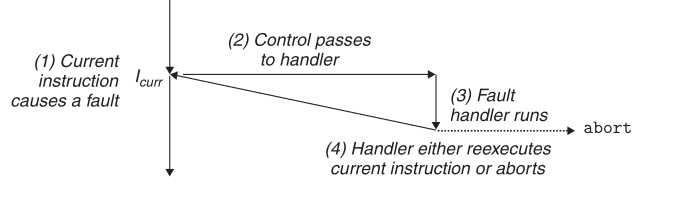
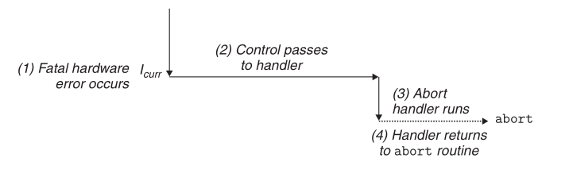

## Exception Control Flow

### Normal Flow

**Sequential execution** is the default behavior of a processor: the program counter moves from address `a_k` to `a_{k+1}`, where each instruction sits adjacent in memory to the next. This is the "smooth" flow.

**Abrupt but program-controlled changes** happen via familiar instructions:
- `jump` — unconditional transfer to a new address
- `call` / `ret` — transfer to a subroutine and back
- `leave` — tears down a stack frame before a return

These are still *program-driven*: the program itself decided, based on its own internal logic, to jump elsewhere. Nothing external forced the issue.

---

### Program-Independent Control Passing



This is the key conceptual leap of the chapter. Sometimes control must change for reasons that have **nothing to do with what the program's variables or logic say** — the system needs to react to something happening *around* the program. This is **Exceptional Control Flow (ECF)**, and it shows up at three levels:

| Level | Example | Mechanism |
|---|---|---|
| **Hardware** | Timer interrupt, page fault, divide-by-zero | Exception → handler |
| **OS** | Switching from process A to process B | Context switch |
| **Application** | One process notifies another of an event | Signals |

Each level reuses the same underlying idea (an abrupt redirect) but at a different scope.

---

### Exception Handling Flow



When a **change in processor state** occurs (an *event*), the processor doesn't just continue blindly — it performs an indirect procedure call into OS-controlled code.

**Exception table:** a jump table set up by the OS at boot time. Entry `k` holds the address of the handler for exception number `k`.

**Exception table base register:** a special CPU register holding the *starting address* of this table. To dispatch:

```
handler_address = *(base_register + exception_number * 4)
```

The exception number is just an index into this table — that's how the hardware knows where to jump without the OS having to look anything up at the moment of the event.



#### How it resembles a procedure call  
- Control transfers to a fixed, predetermined address (like calling a function).  
- A return address is pushed onto a stack so execution can resume afterward.  

#### How it differs from a procedure call
- **Return address ambiguity:** with a call, you always return to the next instruction. With an exception, the handler might return to the **current** instruction (re-run it) or the **next** one — it depends on the exception class.  
- **Privilege change:** an exception handler runs in **kernel mode**, with full access to system resources — a regular function call doesn't elevate privilege.  
- **Stack switch:** if control passes from user code to the kernel, the return address and processor state are pushed onto the **kernel's stack**, not the user program's stack.  
- **No `call` instruction involved** — the transfer is triggered by hardware detecting an event, not by an explicit instruction in the program (except traps, which are intentional).  

### Where Is State Saved Before the Exception Is Handled?

Before branching to the handler, the processor pushes onto the stack:  
- The **return address** (current or next instruction, depending on exception type)  
- Additional processor state needed to resume correctly later — e.g., on IA32, the **EFLAGS register** (condition codes, etc.)  


If the exception causes a switch from user mode to kernel mode, **all of this is pushed onto the kernel's stack**, not the user stack — this protects the kernel from a corrupted or malicious user stack.

### What Does "Return from Interrupt" Do?

After the handler finishes, it optionally executes a special **return-from-interrupt** instruction, which:
1. Pops the saved state back into the processor's control and data registers.
2. Restores the processor to **user mode** (if a user program was interrupted).
3. Transfers control back to the interrupted program — either re-running the current instruction or proceeding to the next one.

### Classes of Exceptions

| Class | Cause | Sync/Async | Return Behavior |
|---|---|---|---|
| **Interrupt** | Signal from external I/O device (timer, disk, network) | Asynchronous | Always returns to **next** instruction |
| **Trap** | Intentional — e.g., a system call | Synchronous | Always returns to **next** instruction |
| **Fault** | Potentially recoverable error (e.g., page fault) | Synchronous | **Might** return to **current** instruction (re-execute), or abort if unrecoverable |
| **Abort** | Unrecoverable hardware error (e.g., memory parity error) | Synchronous | **Never** returns — terminates the program |

**Memory hook:**  
- *Interrupts* come from **outside** the CPU's current instruction stream → async.  
- *Traps, faults, aborts* are all **caused by executing the current instruction** → sync.  
- Only **faults** have a chance of "fixing it and trying again" — that's their defining feature (e.g., a page fault loads the missing page, then re-runs the faulting instruction).  

---


## Traps and System Calls

### What Is a Trap?

A **trap** is an *intentional* exception — unlike a divide-by-zero or a page fault, which happen as side effects of something going wrong, a trap happens because the program **deliberately asked for it**. The program executes a specific instruction whose entire purpose is to trigger an exception on demand.

Like interrupts, trap handlers **always return control to the next instruction** (`I_next`) — never back to the instruction that triggered the trap. There's nothing to "retry," since nothing went wrong.

### The Core Use Case: System Calls

The single most important reason traps exist is to give user programs a controlled, safe way to ask the kernel for help. Think about it from the kernel's perspective: user code can't be trusted to poke directly at the disk controller or the process table — that would make the system fragile and insecure. So the kernel exposes a narrow, well-defined doorway, and a trap is the knock on that door.

Common services requested this way:  
- **`read`** — read a file  
- **`fork`** — create a new process  
- **`execve`** — load and run a new program  
- **`exit`** — terminate the current process  

**The mechanism:** processors provide a special instruction — generically `syscall n` — that user code executes whenever it wants kernel service number `n`. Executing this instruction causes a trap into an exception handler, which:
1. Decodes which service was requested (reading the argument `n`)
2. Dispatches to the appropriate kernel routine to actually perform the service



### System Call vs. Regular Function Call

From the programmer's point of view, calling a system call *looks* exactly like calling any other function — same parentheses, same arguments, same return value. But underneath, the two are fundamentally different:

| | Regular Function Call | System Call |
|---|---|---|
| **Privilege mode** | User mode | Kernel mode |
| **Instruction access** | Restricted | Full access to system instructions |
| **Stack used** | Same stack as the caller | A separate stack defined inside the kernel |

This distinction matters because **kernel mode is powerful** — it can touch hardware, manage memory mappings, and control other processes. The trap is precisely the gate that lets user code briefly "borrow" that power, run a trusted routine, and then drop back into user mode again.

---

## Faults

### What Is a Fault?

A **fault** is an exception triggered by an **error condition** — but, critically, one that *might be fixable*. This "might be fixable" property is what separates faults from aborts, and it's the single most important thing to remember about this class.

When a fault occurs:  
1. Control transfers to the fault handler.  
2. **If the handler can fix the problem** → it returns control to the *same* instruction that faulted (`I_curr`), so that instruction **re-executes** from scratch.  
3. **If the handler cannot fix the problem** → it hands off to an abort routine, which terminates the program.  



### The Canonical Example: Page Faults

This is the example worth internalizing, because it shows exactly *why* the "reexecute" behavior is useful rather than wasteful.

- A program references a virtual address.
- That address's corresponding **page** (a 4 KB chunk of virtual memory) isn't currently sitting in physical memory — it's out on disk.
- This triggers a **page fault**.
- The fault handler's job: locate the page on disk, load it into physical memory.
- The handler then returns control **to the faulting instruction itself** — not the next one.
- This time, when the instruction runs again, the page *is* resident in memory, so it completes normally with no fault.

**Key insight:** the program never "knows" the fault happened. From its perspective, the instruction simply took a little longer to execute. This transparency is what makes virtual memory possible — the OS can lie about what's actually in physical memory at any given moment, and faults are the mechanism that makes the lie work.

---

## Aborts

### What Is an Abort?

An **abort** is what happens when the error is **not recoverable**. Typically these come from hardware-level failures — the textbook's example is a **parity error**, where bits in DRAM or SRAM have been physically corrupted.  

There's no fixing this in software. There's no retry that would help — the underlying data is gone or wrong, and pretending otherwise would just propagate corruption further.  

**Abort handlers never return control to the application.** Instead, the handler passes control to an **abort routine** in the kernel, whose only job is to terminate the offending program.  



---

### Putting Traps, Faults, and Aborts Side by Side

| | Trap | Fault | Abort |
|---|---|---|---|
| **Trigger** | Intentional instruction (`syscall`) | Error condition, possibly fixable | Unrecoverable hardware error |
| **Intent** | Deliberate, programmer wanted this | Unplanned, but expected to occasionally happen | Catastrophic, never expected |
| **Return point** | Always next instruction | Current instruction (if fixed) or never (if not) | Never returns to the program |
| **Real-world example** | `read()`, `fork()`, `exit()` | Page fault | DRAM parity error |

The thread connecting all three: **what determines the return behavior is whether continuing makes sense.**   
A trap continues forward because nothing broke.   
A fault rewinds to retry because something was temporarily missing but is now fixed.  
An abort gives up entirely because there's nothing left to salvage.


## References
1. Section 8.1 in CSAPP(Computer Systems: A Programmer's Perspective)
