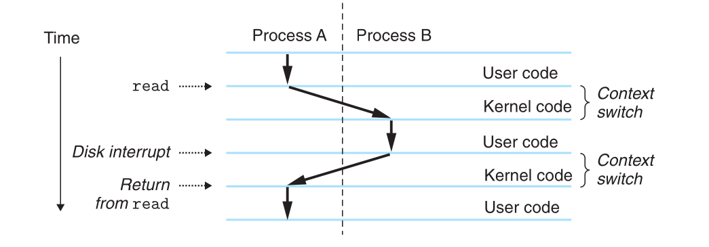
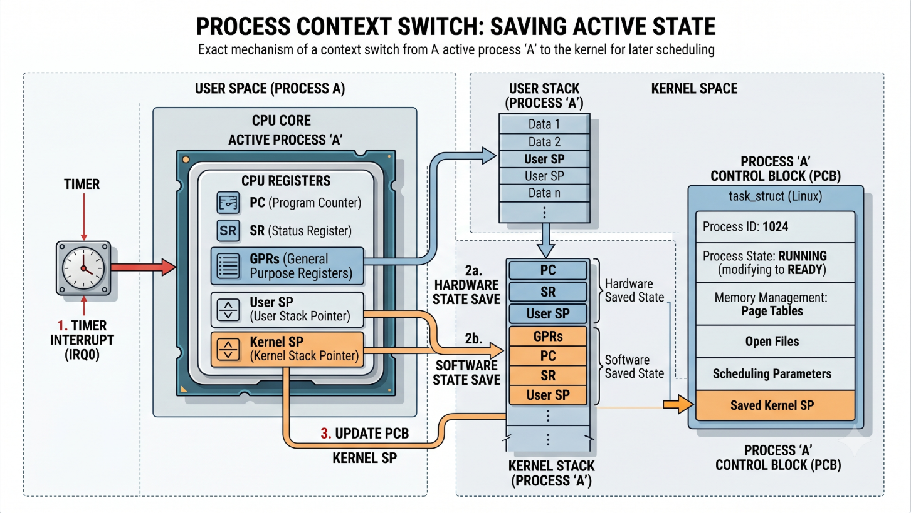

# Lecture 12: Processes
## Exceptions → Processes

A **process** is an executing instance of a program.

The OS uses **exceptions** (interrupts, traps, faults) to implement processes.

Examples:

* Timer interrupt → OS regains control and may schedule another process.
* System call (`read`, `fork`, `exit`) → trap into kernel mode.
* Page fault → kernel loads missing page.

Without exceptions, the OS could not switch between processes or provide protection.

---

## Two Illusions Provided by a Process

### Illusion 1: Exclusive Access to the Processor

Even though many processes exist, each process feels like:

```text
while (running)
    my instructions execute
```

In reality:

```text
A -> B -> A -> C -> B -> ...
```

The OS rapidly switches among processes.

This illusion is provided by:

* Scheduling
* Context switching

---

### Illusion 2: Exclusive Access to Memory

Each process appears to own memory:

```text
0x00000000
...
0xFFFFFFFF
```

But many processes coexist.

The OS provides a **private virtual address space** for each process.

Example:

```text
Process A:
0x1000 -> value 42

Process B:
0x1000 -> value 99
```

Same virtual address, different physical memory.

---

## Logical Control Flow

A **logical control flow** is the sequence of instructions a process believes it is executing.

Example:

```c
printf("A");
printf("B");
printf("C");
```

Logical flow:

```text
A -> B -> C
```

The process sees uninterrupted execution even though the CPU may have switched to other processes in between.

---

## Concurrent Flow

Two flows are **concurrent** if their execution periods overlap.

Example:

```text
Time →

Process A: |-------|
Process B:     |-------|
```

A starts before B finishes.

Therefore:

```text
A and B are concurrent
```

Concurrency does **not** require multiple CPUs.

Even on a single CPU:

```text
A B A B A B
```

is concurrent execution.

---

## Context Switch

A **context switch** occurs when the kernel stops one process and starts another.



Reasons:

* Timer interrupt
* Blocking I/O
* Sleep
* Higher-priority process becomes runnable

---

### What Constitutes a Context?

A process context contains everything needed to resume execution later.

**CPU State**

* Program Counter (PC)
* Stack Pointer (SP)
* General-purpose registers
* Status/flags register

Entire CPU context is stored in the process's kernel stack. Stack pointer that currently points to the top of the user stack is also stored in the kernel stack.

**Memory State**
* Page tables(mapping virtual memory to physical memory) 
* User stack context remains as is in main memory

**OS State**

* PID
* Process state
* Open file descriptors
* Signal handlers
* Kernel stack

  
Source: Google Gemini  

1. **Hardware Privilege Escalation**: The CPU switches from user mode to kernel mode.  

2. **Hardware State Save**: The CPU hardware automatically pushes the most critical registers (like the Program Counter, Status Register, and the user-mode Stack Pointer) onto the process's Kernel Stack.  

3. **Software State Save**: The OS kernel takes over and pushes the remaining general-purpose CPU registers onto that same Kernel Stack.  

4. **Updating the PCB**: The kernel saves the current kernel Stack Pointer into the outgoing process's PCB (task_struct). The process state is updated from "Running" to "Ready" or "Blocked."  


Conceptually:

```text
Context =
{
    registers,
    PC,
    stack,
    page table,
    open files,
    kernel metadata
}
```

During a context switch:

```text
save(old_context)
restore(new_context)
```

---


## States of a Process

A process typically moves through these states:

```text
         +---------+
         | Running |
         +---------+
           /     \
          /       \
         v         v
 +---------+   +-----------+
 | Ready   |   | Blocked   |
 +---------+   +-----------+
```

**Running**: Currently executing on CPU.  

**Ready**: Ready to run, waiting for CPU.

**Blocked / Waiting**: Waiting for an event:

* Disk I/O
* Network I/O
* Child process

**Stopped**: Suspended by signal:

```bash
Ctrl+Z
```

Signals:

```text
SIGSTOP
SIGTSTP
```

**Terminated**: Execution finished:

```c
return 0;
```

or

```c
exit(0);
```

---

## Process ID (PID) and Parent Process ID (PPID)

Every process has:

**PID**: Unique process identifier.

```c
getpid()
```

Example:

```text
PID = 1205
```

**PPID**: Parent process identifier.

```c
getppid()
```

Example:

```text
bash (PID=100)
   |
   +-- vim (PID=1205)
```

For `vim`:

```text
PID  = 1205
PPID = 100
```

---
## Different commands to investigate processes
1. strace: Prints a trace of each system call invoked by a running program and
its children. A fascinating tool for the curious student. Compile your
program with -static to get a cleaner trace without a lot of output related
to shared libraries.  
2. ps: Lists processes (including zombies) currently in the system.  
3. top: Prints information about the resource usage of current processes.
4. pmap: Displays the memory map of a process.  
5. /proc: A virtual filesystem that exports the contents of numerous kernel data
structures in an ASCII text form that can be read by user programs. For example,
type "cat /proc/loadavg" to see the current load average on your Linux system.  


---
