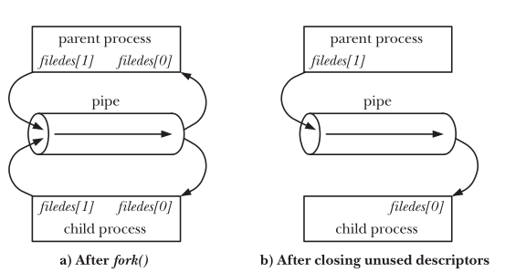

## Taxonomy Overview  
UNIX provides a rich variety of IPC mechanisms categorized into three functional domains:  
- **Communication:** Exchanging data between processes.  
- **Synchronization:** Coordinating the actions of processes or threads.  
- **Signals:** Primarily for notifications, but can be used for synchronization and limited communication (realtime signals carry an integer/pointer).  

> *Note: Although some facilities are strictly for synchronization, the umbrella term **Interprocess Communication (IPC)** is often used to describe them all.*  

---  

## Communication Facilities  
Communication facilities allow processes to exchange information. They fall into two main paradigms:  

### A. Data-Transfer Facilities  
Data is explicitly written by one process and read by another. This requires **two data transfers** per message: 
`User Memory → Kernel Memory (write) → User Memory (read)`  

| Subcategory | Description | Examples |  
| :--- | :--- | :--- |  
| **Byte Stream** | Data is an undelimited sequence of bytes. Reads can fetch arbitrary amounts regardless of write block sizes. Mirrors the UNIX "file as a sequence of bytes" model. | Pipes, FIFOs, Datagram Sockets |  
| **Message** | Data is exchanged as delimited messages. A read operation must consume a *whole* message; partial reads or multi-message reads in one call are not possible. | System V / POSIX Message Queues, Datagram Sockets |  
| **Pseudoterminals** | Specialized communication facilities for terminal emulation and master/slave interactions. | `pty` |  

**Key Characteristics of Data-Transfer:**  
- **Destructive Reads:** Once data is read, it is consumed and no longer available to other processes *(Exceptions: `MSG_PEEK` for sockets, UDP multicast/broadcast)*.  
- **Automatic Synchronization:** If a process attempts to read from an empty facility, the kernel automatically blocks the reader until a writer provides data.  

### B. Shared Memory  
Multiple processes map their page tables to the exact same physical RAM pages. One process places data in memory, and others can access it directly.  
- **Zero-Copy Speed:** No data transfer between user and kernel memory is required, making it the fastest IPC method.  
- **Non-Destructive Reads:** Data remains visible to all sharing processes until explicitly overwritten.  
- **Manual Synchronization Required:** Because access is direct and unprotected, concurrent reads/writes will cause race conditions. Applications *must* use synchronization primitives (like semaphores) to protect shared data structures.   

### Quick Comparison: Data-Transfer vs. Shared Memory  

| Feature | Data-Transfer Facilities | Shared Memory |  
| :--- | :--- | :--- |  
| **Performance** | Slower (requires 2 kernel context switches) | Fastest (zero-copy, direct RAM access) |  
| **Read Semantics** | Destructive (data is consumed) | Non-destructive (data persists) |  
| **Synchronization** | Automatic (blocks on empty read) | Manual (requires semaphores/locks) |  
| **Complexity** | Simpler to implement | Higher complexity due to manual locking |  

---  

## Synchronization Facilities  
Synchronization ensures processes coordinate their actions to prevent race conditions (e.g., simultaneous updates to shared memory or files).  

### Semaphores  
A kernel-maintained integer that is never permitted to fall below `0`.  
* **Decrement (Wait/P):** Reserves access. If the value would drop below 0, the kernel blocks the process until another process increments it.  
* **Increment (Signal/V):** Releases access so other processes can acquire the resource.  
* **Types:** Can be *binary* (0 or 1) for mutual exclusion, or *counting* (up to $N$) for multiple shared resources. Available in both System V and POSIX flavors.  

### File Locks  
Explicitly designed to coordinate multiple processes operating on the same file or other resources.  

| Type | `flock()` | `fcntl()` |  
| :--- | :--- | :--- |  
| **Granularity** | Whole-file locking only | Record/region-level locking |  
| **Usage** | Simple, rarely used in modern systems | Flexible, preferred for complex apps |  

* **Read (Shared) Lock:** Multiple processes can hold it simultaneously.  
* **Write (Exclusive) Lock:** Blocks all other read and write locks on that file/region.  

### Mutexes & Condition Variables  
* Primarily designed for **POSIX threads** (intra-process synchronization).  
* While some implementations (like Linux NPTL) allow process-shared mutexes, they are not universally available or commonly used for interprocess synchronization due to portability concerns.  

### Using Communication Facilities for Sync  
Any data-transfer facility can be repurposed for synchronization by using the block/unblock mechanics. 
* **Pipes as Barriers:** A parent process blocks on `read()` from a pipe until children write to it, effectively synchronizing their startup or completion.  

### Linux-Specific: `eventfd`  
*(Available since Kernel 2.6.22)*  
A lightweight synchronization mechanism providing a kernel-maintained **8-byte unsigned integer** via a file descriptor.  
* **Write:** Adds an integer to the object's value.  
* **Read:** Blocks if the value is `0`. If non-zero, returns the current value and atomically resets it to `0`.  
* **Polling:** Can be used with `poll()`, `select()`, or `epoll()` to efficiently wait for events without busy-waiting.  

> 💡 **Rule of Thumb:** The choice of synchronization facility depends on the resource being coordinated. File record locking (`fcntl`) is best for files, while semaphores or `eventfd` are generally better for abstract shared resources.  

---  
## Pipes  

```c  
#include <unistd.h>  
int pipe(int filedes[2]);  
    Returns 0 on success, or –1  
```  

How are pipes created and used?  
Who manages the pipes and syncronization around pipes?  
How can i recreate something like a pipe myself?  
  


---  


1. Pipe Anatomy  
A pipe is a **unidirectional** channel in the kernel's memory. It is created using `pipe(int fd[2])`, which returns two file descriptors:  

| Descriptor | Direction | Purpose |  
| :--- | :--- | :--- |  
| `fd[0]` | **Read End** | Pull data out of the pipe buffer. |  
| `fd[1]` | **Write End** | Push data into the pipe buffer. |  

> **Note:** Data always flows from Writer → Reader. If you need two-way communication, you must create **two separate pipes**.  

---  

### The "Golden Rule" of Deadlock Prevention  
In almost every IPC scenario involving `fork()`, processes hold file descriptors they do not use. 
**Rule:** Immediately close the opposite end in each process.    

| Process | Action Required | Why? |  
| :--- | :--- | :--- |  
| **Writer** | `close(fd[0]);` | Frees a kernel slot; prevents the pipe from staying "half-open" forever. |  
| **Reader** | `close(fd[1]);` | Ensures that when all writers finish, the reader receives an EOF instead of blocking forever. |  

---  

### The State Machine of `read()`  
The behavior of the reader depends entirely on two factors: whether there is data in the buffer, and how many active writers exist globally.  
  
| Data in Buffer? | Global Open Writers (`fd[1]`) | Behavior of `read(fd[0], ...)` | Return Value |  
| :--- | :--- | :--- | :--- |  
| **Empty** | ≥ 1 | **Blocks** (Sleeps until a writer provides data). | Blocks |  
| **Has Data** | Any | Pulls up to requested bytes immediately. | `> 0` (bytes read) |  
| **Empty** | **0** | Triggers **EOF**. No writers left; the pipe is finished. | `0` |  
| **Interrupted** | Any | OS returns an error if a signal (e.g., Ctrl-C) hits. | `-1` (`errno = EINTR`) |  

---  

### Synchronization via Pipes (The Barrier Pattern)  
Pipes can act as synchronization tools because a writer's `close()` contributes to the total reference count of the pipe. 

#### The Logic  
1. **Parent spawns $N$ children** and gives them all `fd[1]` (write).  
2. Children do initialization work, then write `1 byte` to signal "I'm ready".  
3. **Parent closes its own writer** and enters a `while (read() == 1)` loop.  
4. The loop exits only when the total references to `fd[1]` hit zero.  

#### What happens if a child exits prematurely?  
If Child #3 crashes or calls `exit()` without writing:  
1. The kernel implicitly closes Child #3's file descriptor table.  
2. The global count of open writers decreases by 1.  
3. The parent's `read()` loop is **not interrupted immediately** (as long as other children are still running).  
4. Once the very last child closes its FD, the pipe hits EOF (`read` returns `0`) and the barrier breaks.  

---  

### Two-Way Communication Pattern  
To achieve a request/response cycle, you need two pipes:  
* **Pipe A (`p2c`)**: Parent writes `[1]`, Child reads `[0]`.  
* **Pipe B (`c2p`)**: Child writes `[1]`, Parent reads `[0]`.  

```c  
int p2c[2], c2p[2];  
pipe(p2c); 
pipe(c2p);  

pid_t pid = fork();  
if (pid == 0) { // Child  
    close(p2c[1]); close(c2p[0]);  
    // Read parent, then write reply  
} else {       // Parent  
    close(p2c[0]); close(c2p[1]);  
    // Write to child, then read reply  
}  
```  

### Error Handling in `read()` Loops  
When writing loops that block on pipes, always handle `-1` gracefully. If a signal interrupts your process, you should resume the loop rather than breaking out of it entirely.  

```c  
ssize_t n;  
while ((n = read(fd, buf, 1)) == -1 && errno == EINTR) {  
    // Do nothing, just retry the read() call automatically  
}  
// Now n is either >0 (success) or 0 (EOF)  
```  

## References  
- Chapter 43, Linux Programming Interface, Michael Kerrisk  
- Section 44.1-44.5, Linux Programming Interface, Michael Kerrisk
