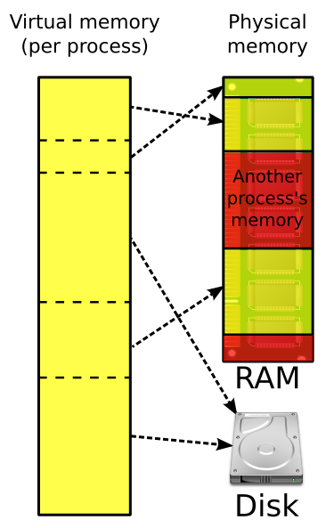
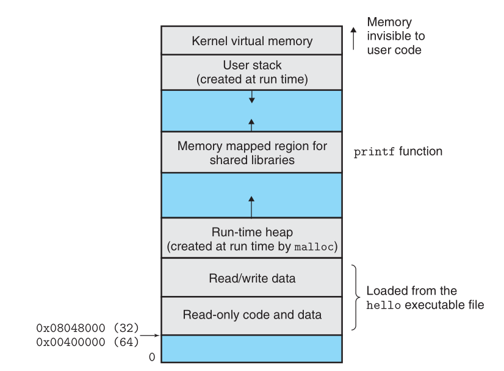
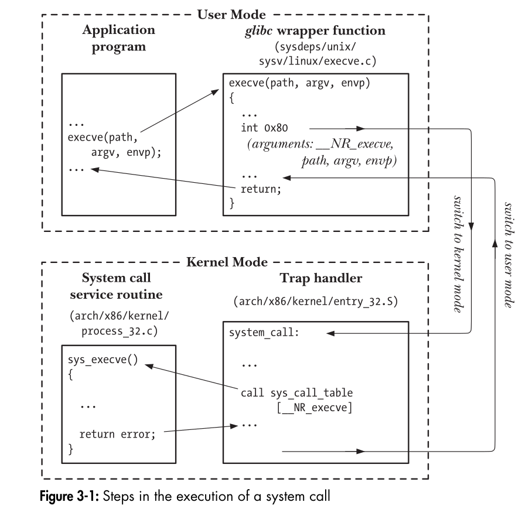

## Agenda

1. Process layout
	1. Stack/heap
---
## Memory allocation of a program


---
### Process address space



**Program code and data:** Code begins at the same fixed address for all processes,
followed by data locations that correspond to global C variables. The code and
data areas are initialized directly from the contents of an executable object file.

**Heap:** The code and data areas are followed immediately by the run-time heap.
Unlike the code and data areas, which are fixed in size once the process begins
running, the heap expands and contracts dynamically at run time as a result
of calls to C standard library routines such as malloc and free. 

**Shared libraries:** Near the middle of the address space is an area that holds the
code and data for shared libraries such as the C standard library and the math
library. The notion of a shared library is a powerful but somewhat difficult
concept. 

**Stack:** At the top of the user’s virtual address space is the user stack that
the compiler uses to implement function calls. Like the heap, the user stack
expands and contracts dynamically during the execution of the program. In
particular, each time we call a function, the stack grows. Each time we return
from a function, it contracts.

**Kernel virtual memory:**  The kernel is the part of the operating system that is
always resident in memory. The top region of the address space is reserved for
the kernel. Application programs are not allowed to read or write the contents
of this area or to directly call functions defined in the kernel code.


---

### Properties

| Memory Segment | Type of Variables                                           | Characteristics                                |
| -------------- | ----------------------------------------------------------- | ---------------------------------------------- |
| Stack          | - Local variables                                           | - Automatic allocation and deallocation        |
|                | - Function call frames                                      | - LIFO (Last In, First Out) order              |
|                | - Parameters                                                | - Limited size                                 |
|                | - Temporary variables                                       | - Exists only for the duration of the function |
| Heap           | - Dynamically allocated variables (using `new` or `malloc`) | - Manual allocation and deallocation           |
|                | - Objects and arrays allocated at runtime                   | - Can grow as needed                           |
|                |                                                             | - Fragmentation possible                       |
| Program Data   | - Global variables                                          | - Initialized at program start                 |
| (Data Segment) | - Static variables                                          | - Divided into initialized and uninitialized   |
|                | - Constants                                                 | - Global lifetime                              |
|                | - Strings                                                   | - Accessible throughout the program            |
| Code Segment   | - Executable instructions                                   | - Read-only                                    |
| (Text Segment) |                                                             | - Contains compiled code                       |
### Default values

| Variable Type                     | Memory Segment | Default Initialization               |
| --------------------------------- | -------------- | ------------------------------------ |
| Local Variables                   | Stack          | Undefined (contains garbage values)  |
| Global Variables                  | Data Segment   | Zero-initialized (0 for basic types) |
| Static Variables                  | Data Segment   | Zero-initialized (0 for basic types) |
| Dynamically Allocated             | Heap           | Undefined (contains garbage values)  |
| Built-in Types (int, float, etc.) | Stack/Heap     | Undefined (contains garbage values)  |
| Built-in Types (Global/Static)    | Data Segment   | Zero-initialized (0 for basic types) |
| User-Defined Types                | Stack/Heap     | Default constructor (if provided)    |

---

### Related bash commands
```bash

# return the maximum memory available to program stack(in KB)
ulimit -s 

# return the maximim heap memory available to a program
ulimit -v

# set maximum heap memory to 2GB
ulimit -v 2097152
```

### Segmentation fault experiment
```bash
#include <stdio.h>
void causeSegmentationFault(int depth) {
    // function calls itself by appending the argument
    // note there is no stopping condition in the recursion, hence it will keep on calling itself forever.
    // thereby expanding stack
    printf("Recursion depth: %d\n", depth);
    causeSegmentationFault(depth + 1); // Recursive call with increased depth
}
int main() {
    causeSegmentationFault(1); // Start the recursion
    return 0;
}
```

```c
```


## System calls



User space/kernel space
glibc


## References:
1. [Assembly Cheat Sheet - CheatDocs](https://cheatdocs.org/assembly)
2. [Compiler Explorer](https://godbolt.org)
