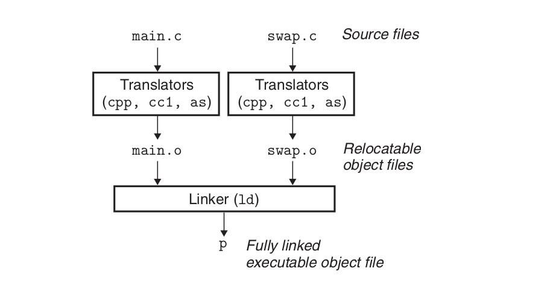
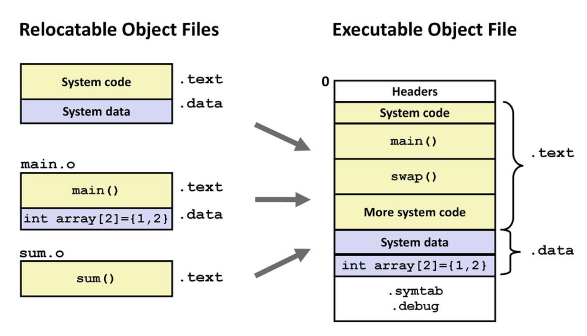

---
delivery date:
---
# Agenda

1. Thorough understanding of compilation process
2. How C++ programs do IO?

## Compilation process

Programs are translated by other programs into different forms:
Different stages of compilation process:  

1. **Preprocessing phase:** In this phase, the preprocessor is responsible for handling directives such as #include, #define, and #ifdef. It processes these directives and modifies the source code accordingly. It also removes comments and whitespace, and incorporates header files into the source code.

2. **Compilation phase:** In this phase, the preprocessed source code is translated into assembly language. The compiler parses the code, checks it for errors, and translates it into a low-level intermediate representation. This phase also involves optimizations to improve the efficiency of the generated code.

3. **Assembly phase:** In this phase, the assembly code generated in the compilation phase is translated into machine code ([[Object code]]) by the assembler. The assembler converts the symbolic instructions and addresses into binary code that can be understood by the computer's processor.

4. **Linking phase:** In this final phase, the linker links all the Object code files generated in the compilation phase and resolves external references. It combines the object code files with any necessary system libraries and generates the final executable file. The linker also performs any necessary relocations and generates a symbol table for the program.

Hello World program:

```c++
// main.c
#include <stdio.h>

int main()
{
    printf("hello world\n");
    return 0;
}
```

## Compilation steps

```bash

# Preprocessing
gcc -E main.c -o main.i

# Compilation
gcc -S main.i -o main.s

# Assembly
gcc -c main.s -o main.o

# Linking
gcc main.o -o main

# Combined
gcc main.c -o main
```

## Entry point

The entry point of a C++ program is the function where execution starts. This is typically the `main function`. The main function has a special significance and specific rules regarding its declaration, return type, and parameters.

**Parameters**  
*argc (Argument Count):* An integer representing the number of command-line arguments passed to the program, including the program's name.  
*argv (Argument Vector):* An array of C-strings (char*) representing the actual arguments. argv[0] is the name of the program, and argv[1] through argv[argc-1] are the additional arguments.

**Return Type**  
The return type of main is int, which allows the program to return a status code to the operating system.  
By convention:  
return 0; indicates successful execution.  
Non-zero values indicate errors or abnormal termination.

---

## Multifile compilation

1. **Preprocessor** processes each source file and act upon preprocessor directives(hash directives). (test.cpp => test.i)
2. **Compiler** takes in the resultant source file and compile it to assembly code. (test.i => test.s)
3. **Assembler** takes in the assembly file and convert it into a relocatable object code. (test.s => test.o)
4. **Linker** takes multiple object files and generate a single executable file (test.o => test.out)

---

Linker positioned in compilation process.  
Pic credits: CSAPP

---

#### Linker

Linker  perform two main tasks:  
**Symbol resolution:** Object files define and reference symbols. The purpose of symbol resolution is to *associate each symbol reference with exactly one symbol definition.*  
**Relocation:** Compilers and assemblers generate code and data sections that start at address 0. The linker relocates these sections by associating a memory location with each symbol definition, and then modifying all of the references to those symbols so that they point to this memory location.

---

Relocation  
Pic credits: CSAPP

---

#### declaration vs definition vs initialisation vs assignment

**Declaration**: Introduces the name of a variable, function, class, etc., and its type, without allocating memory or providing an implementation.  
**Definition**: Provides the actual implementation or allocation of memory for the declared entity.  
**Initialization**: Assigning an initial value to a variable at the time of its definition.  
**Assignment:** replaces existing value of a variable with a new value

---

```c++
extern int globalVar; //declaration of a variable 

int add(int, int); //declaration of a function
int globalVar; //definition of a variable with default assignment

// definition of a function
int add(int a, int b) {
    return a + b;
}

//definition with initialization
int globalVar = 5;
// assignment
globalVar = 5;
```

---

#### header files vs source files

| Aspect          | Header Files (`.h`, `.hpp`)                                                                  | Source Files (`.cpp`, `.cc`, `.cxx`)                                                         |
| --------------- | -------------------------------------------------------------------------------------------- | -------------------------------------------------------------------------------------------- |
| **Purpose**     | Declarations of functions, classes, and variables. Provides interfaces and API definitions.  | Definitions and implementations of functions and classes. Contains the actual code logic.    |
| **Compilation** | Included in source files using `#include` directive. Not compiled independently.             | Compiled independently into object files (`.o`, `.obj`).                                     |
| **Dependency**  | Can include other header files and itself included by multiple source files.                 | Depends on header files for declarations and can include other header files.                 |
| **Reusability** | Promotes code reuse and modularity by providing common interfaces for multiple source files. | Implements the reusable logic defined in header files.                                       |
| **Visibility**  | Provides an interface for other files to use without revealing the implementation details.   | Contains implementation details that are not exposed to other parts of the program directly. |

---

#### Directives

Hash directives, also known as preprocessor directives, are instructions that are processed by the preprocessor before the actual compilation of the code begins.

| Directive                    | Purpose                                                                |
| ---------------------------- | ---------------------------------------------------------------------- |
| #include                     | Links a header file in the source code.                                |
| #define                      | Creates a symbolic or macro constant.                                  |
| #undef                       | Deletes a macro that has already been defined.                         |
| #ifdef / #ifndef             | Compilation that is conditional on the presence or absence of a macro. |
| #if / #elif / #else / #endif | Compilation that is conditional based on some expression.              |
| #error                       | Halts the compilation process and produces an error notice.            |
| #warning                     | During compilation, a warning notice is shown.                         |
| #pragma                      | Provide the compiler specific instructions.                            |

---

#### sharing variables across files

**`extern` Keyword**:

- Used to declare a variable or function in a different file, indicating that its definition exists elsewhere.
- Helps in sharing global variables across multiple files.

The `extern` keyword establishes external linkage, making the variable or function accessible across different translation units.

---

#### Example code

Project structure

```css
project/
├── main.c
├── math_functions.h
└── math_functions.c

```

---
math_functions.h

```c
#ifndef MATH_FUNCTIONS_H

#define MATH_FUNCTIONS_H

int add(int, int);
int subtract(int, int);
  

#endif
```

math_functions.c

```c++
#include "math_functions.h"
int add(int a, int b) { return a + b; }
int subtract(int a, int b) { return a - b; }
```

---

main.c

```c
#include <stdio.h>
#include <stdlib.h>
#include "math_functions.h"
int main(int argc, char *argv[]) {
if (argc != 3) {
 printf("Please enter 2 numbers.\n");
return 1;
}

  

int x = atoi(argv[1]);
int y = atoi(argv[2]);


printf("Addition: %d\n", add(x, y));
printf("Subtraction: %d\n", subtract(x, y));
return 0;
}

```

---

##### Compilation steps

```bash
# Compile math_functions.c
gcc -c math_functions.c -o math_functions.o

# Compile main.c
gcc -c main.c -o main.o

# Link object files
gcc main.o math_functions.o -o my_program

```

---

# References

1. CSAPP - Chapter 1  
2. Chapter 7: Linking(7.1-7.8) - CSAPP
