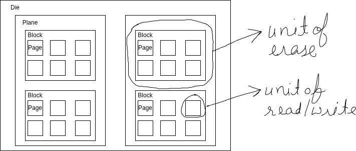

Quick recap  
1. Abstractions (processes, files, virtual memory, instruction set, virtual machine)  
2. investigate processes using ps, htop  
3. Parent child processes  
4. GUI vs CLI process launching  
---
#### Device Representation in Linux
- In Linux, hardware devices are abstracted as **files** and are typically located under the `/dev/` directory.  
- This "everything is a file" philosophy allows applications to interact with hardware using standard file operations (`open`, `read`, `write`, `close`).  

---
#### Character Devices vs Block Devices

| Feature                | Character Device                                   | Block Device                                         |
| ---------------------- | -------------------------------------------------- | ---------------------------------------------------- |
| **Access Model**       | Unbuffered, byte-by-byte (stream-oriented)         | Buffered, random access in fixed-size blocks         |
| **First char in `ls`** | `c`                                                | `b`                                                  |
| **Use Cases**          | Keyboards, mice, serial ports, terminals, printers | Hard drives, SSDs, USB storage, CD/DVD drives        |
| **Concurrency**        | Typically exclusive access per session             | Supports simultaneous read/write with caching        |
| **Examples**           | `/dev/tty0`, `/dev/mem`, `/dev/null`, `/dev/uart1` | `/dev/sda`, `/dev/nvme0n1`, `/dev/loop0`, `/dev/vda` |

---
#### Major & Minor Device IDs
When you list a device file, you'll see a pair of numbers: `(major, minor)`. These IDs inform the kernel how to route I/O requests to the correct hardware.  

| ID Type   | Purpose                                                              | Example Context                           |
| --------- | -------------------------------------------------------------------- | ----------------------------------------- |
| **Major** | Identifies the **device driver** (kernel module) handling the device | `8` → SCSI/SATA disk driver (`sd_mod`)    |
| **Minor** | Identifies the **specific device/partition** managed by that driver  | `0` → `/dev/sda`, `1` → `/dev/sda1`, etc. |

**How they work together:**
- The kernel uses the **major number** to find the correct driver.  
- It passes the **minor number** to that driver, which decodes it to target the exact hardware component or logical partition.  

**Viewing IDs:**
```bash
# Shows (major, minor) in parentheses after owner/group columns
ls -l /dev/sda # older notation
ls -l /dev/nvme*
# Output: brw-rw---- 1 root disk 8, 0 Jul 25 12:00 /dev/sda
#         ^          ^  ^  ^     ^  ^
#         Type       LinkOwner Group Major Minor

# Inspect detailed inode/device info
stat /dev/sda
```

---
#### HDD vs SSD


Image credits: [Backblaze](https://www.backblaze.com/blog/ssd-vs-hdd-future-of-storage)

Total Read Time = **Seek time  + Rotational latency (HDD only)  + Transfer time (sequential read)**


| Pattern              | HDD                | SSD        |
| -------------------- | ------------------ | ---------- |
| **Sequential read**  | Excellent          | Excellent  |
| **Random read**      | Terrible           | Acceptable |
| **Seek cost**        | Dominant           | None       |
| **Throughput**       | High if sequential | High       |
| **Latency variance** | Huge               | Small      |

##### HDD Semantics (Magnetic Storage)


Image credits: [Medium](https://medium.com/@youssefshibl000/database-internals-chapter-2-b-tree-basics-ffa4983afa8c)

Units of Operation

* **Sector:** The Sector is the atomic unit for Reading, Writing, and Overwriting.


* **Reads:** Mechanical seek + rotation
* **Writes:** In-place overwrite (old data is destroyed)
* **Deletes:** Metadata-only; data remains until overwritten
* **Bottleneck:** Seek time (milliseconds)

Implications:

* Data layout matters enormously
* [Fragmentation](https://en.wikipedia.org/wiki/File_system_fragmentation) hurts performance
* Defragmentation helps

---

##### SSD Semantics (NAND Flash)



SSDs are governed by a **write–erase asymmetry**.

Units of Operation

-  **Page:** Smallest read/write unit (4KB–16KB)
- **Block:** Smallest erase unit (multiple pages, often MBs)

One-Way Writes  
- Cells start erased (`1`)  
- Writes flip bits to `0`  
- You **cannot flip `0 → 1` without erasing the entire block**

---

##### Out-of-Place Updates (Copy-on-Write)

Because pages cannot be overwritten:
* Updates are written to **new pages**
* Old pages are marked **stale**
* Physical data moves over time  

This applies to:

* File edits
* Database updates
* Metadata changes

---

##### Flash Translation Layer (FTL)

The FTL is firmware running inside the **SSD controller**.

Its responsibilities:

* Map **logical block addresses (LBAs)** to **physical pages**
* Perform wear leveling
* Handle garbage collection
* Hide flash complexity from the OS

Key insight:

> Logical addresses are stable; physical locations are not.

---
---
#### Related Commands & Files
- `/proc/devices`: Lists registered character and block device drivers with their major numbers
- `lsblk`: Block device tree listing (partitions, mountpoints, types)
- `dmesg | tail`: View kernel ring buffer for device detection/plug events
- `udevadm info -a -n /dev/sda`: Inspect device properties and udev rules

---


#### Filesystem navigation(1)
1. `pwd`: Prints current directory
2. `ls` : list directories
3. `cd` change directory
4. `mkdir` create directory
6. `touch`: Create empty file
7. `rm`: remove files
8. `rmdir`: removes directory

---
#### Filesystem navigation(2)

| Absolute addressing                                          | Relative addressing                                                                                                      |     |
| ------------------------------------------------------------ | ------------------------------------------------------------------------------------------------------------------------ | --- |
| Specify full path of the file/directory                      | Specify paths relative to current directory using 2 special symbols: **.**(current directory) & **..**(parent directory) |     |
| **Pros:**<br>- Precision<br>- Stability:<br>- Easy Debugging | **Pros:**<br>- Flexibility<br>- Portability<br>- Simplified Maintenance                                                  |     |
|                                                              |                                                                                                                          |     |

---
#### File exploration using ls
1. `ls ` command is the one of the most used commands on terminal. It is used to list the directory content.
	Two main options are:
	- `ls -a`: Show all files including hidden files
	- `ls -l` : List content of the directory in the long format. 

---
#### Understanding ls command output

| Field           | Meaning                                    |
| --------------- | ------------------------------------------ |
| -rw-rw-r--      | Access rights                              |
| 2               | File's number of hard links.               |
| ankush          | The user name of the file's owner.         |
| ankush          | The name of the group which owns the file. |
| 26              | Size of the files in byte                  |
| 26 Jul 25 06:48 | Last modified date                         |
| hello.txt       | name of the file                           |

---
#### Filesystem 
A filesystem is a method and data structure that an operating system uses to manage and organize files on a storage device such as a hard drive, SSD, or USB flash drive.  
Eg: ext3, ext4, ntfs, fat32  

Related commands/utilities: `gparted`

---
#### Organisation of files
- **Inode:** It is a data structure that stores metadata about a file or a directory, except for its name and actual data content.   When you create a file, the filesystem allocates an inode and assigns it an inode number.  
- **Unique Identification**: Each inode has a unique number within the filesystem, called the inode number.  
- **Mapping**: filenames => inode numbers. When you access a file by name, the filesystem looks up the inode number in the directory.    
---
#### Hard links vs softlinks

| Feature                 | Hard Link               | Soft Link             |
| ----------------------- | ----------------------- | --------------------- |
| Points to               | Inode                   | Path                  |
| Can link to directories | No                      | Yes                   |
| Deleting original file  | Data remains accessible | Link becomes broken   |
| Filesystem limitations  | Same filesystem only    | Can cross filesystems |

---
#### File ownership
In Linux file ownership happens at 3 levels:  
1. User: Every file is owned by a single user. By default it"S the creator of the file   
2. Group: In case multiple users needs to be shared the same files. Groups are created. Users are added to that group and group is also made the owner of the file.  
3. Others: Rest of the users    
Relevant commands: `id`,  `umask`, `chown`, `chgroup`

---
#### File Permissions
Access rights to files and directories are defined in terms of read access, write access, and execution access.

---
#### File and Directory Permissions(1)

| Access | Files                          | Directories                                                         |
| ------ | ------------------------------ | ------------------------------------------------------------------- |
| **r**  | can  be opened and read.       | Allows a directory's contents to be listed(r+x).                    |
| **w**  | can be written to or truncated | Allows files within a directory to be created/deleted/renamed (w+x) |
| **x**  | can be executed.               | Allows a directory to be entered, e.g., `cd directory`.             |

---
#### File and Directory Permissions(2)
1. `chmod`:
```bash
# adds x permission to file
   chmod +x hello.txt 
   # change permissions using binary notation
   chmod 755 hello.txt 
```
2. `umask`: default permissions a file get upon creation
```bash
umask
# outputs: 0002
```

